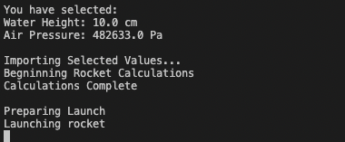
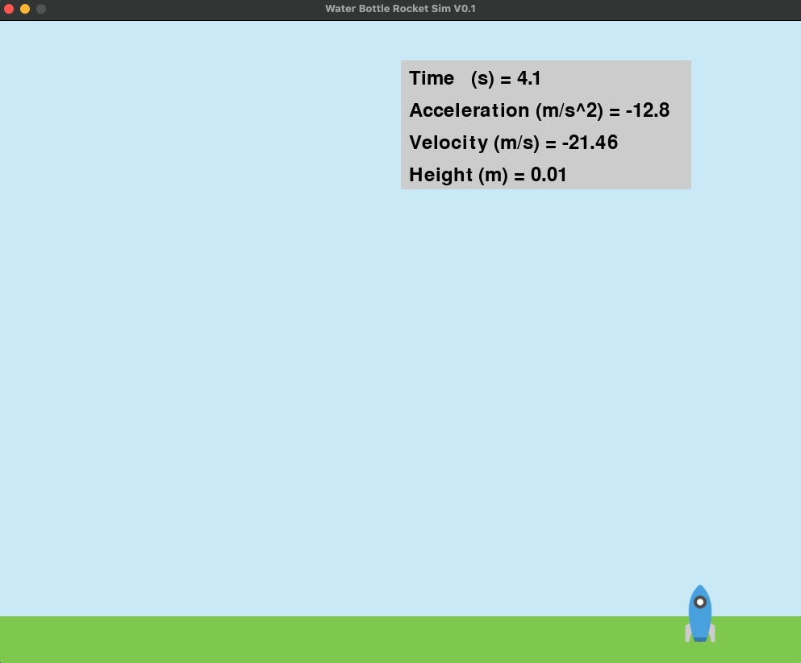
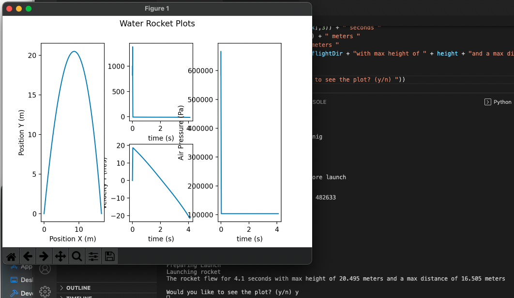

# Model Water Bottle Rocket - ME495 W21 S005
 University of Michigan
 MECHENG 495 W21 Section 005
 Lab 3 - Model Water Rocket Code

The program works through a command line interface (CLI) and once the numbers have been crunched the program displays an animated 2D flight path of a water bottle rocket as well as plots for acceleration, velocity, position, and air pressue in the bottle. 

The program has two focuses:
- Compute the mathematical model of the water bottle rocket's various stages of flight to determine its' trajectory. (done in waterRocket.py)
- Make the program interactive so it can be used to teach students in various grades. (done in RocketSim.py)

## Requirements
- Pyhton 3 or higher
- Libraries
  - PyGame
  - NumPy
  - Pandas
  - MatPlotLib

## Example (played at over 200% speed. Approx Run Time: 1.5 minutes)

Inputs Selected for the Video: 
- Height of Water (cm): 10
- Air Pressure (Pa): 482633

## Screenshots 
Greetings:
- 

Input:
- 
- 

Animation:
- 
- 

Plot:
- 